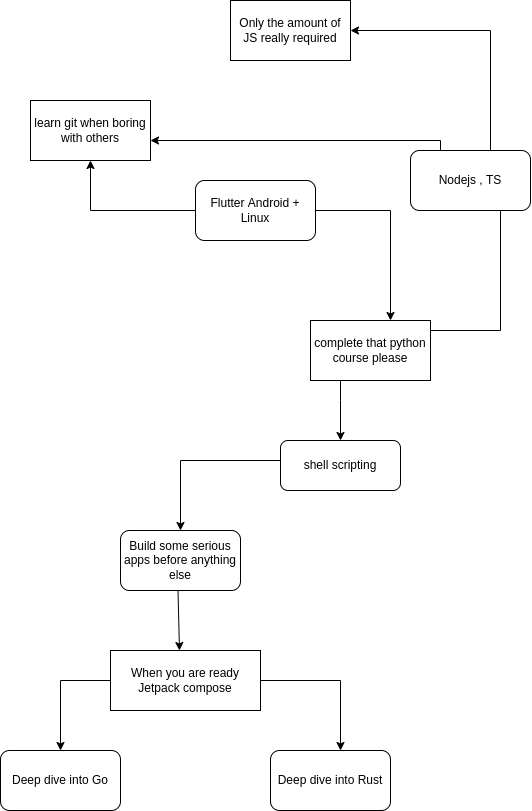

## Say it out loud , what would you like to learn ??

#### Languages

*   Flutter Development
*   Native android with jetpack compose
*   Little bit of Rust
*   Little bit of Go
*   Javascript / Typescript 
*   A bit of python
*   Native linux with Gnome
*   shell scripting

#### Helpers

*   Git
*   Regex

#### Apps

*   Proper Clock app for linux
*   Shutdown PC osmium
*   Send messages and links and other files between PC and Android
*   Notify anything for android with firebase

 

